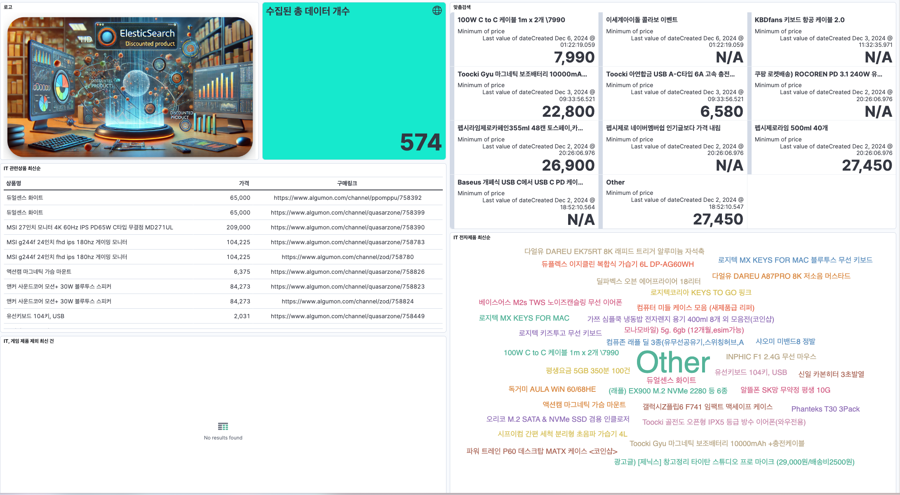
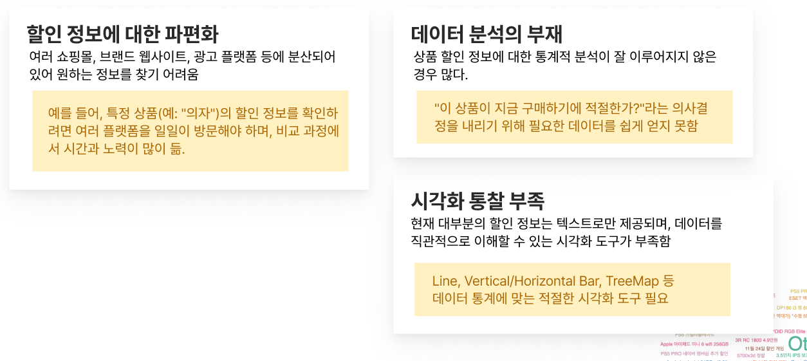

# What is This?
---

> elk 구성 도커는 `deviantony/docker-elk` [레포지토리](https://github.com/deviantony/docker-elk?tab=readme-ov-file#how-to-configure-logstash) 를 참고하였습니다.
---

### [서비스 소개 및 개발 정리 자료](https://docs.google.com/presentation/d/1f9LXfISftyISxTM5cHIVEKyxvASFGXa8/edit?usp=sharing&ouid=104965421521362907472&rtpof=true&sd=true)

# Introduce

다양한 소스로부터 정형화된 할인 제품 데이터들을 수집하여 사용자의 니즈에 맞는 정보로
시각화하여 보여준다.

사용자는 자신이 원하는 데이터에 대해서 ES 활용해 단순하게는 표 형태부터 다양한 그래프를 통한 데이터 분석 및 통계를
대시보드 형태로 구현할 수 있다.
또한 특정 제품군에 대해 일정 가격 이하 할인 발생에 대해 알림 기능을 제공한다.

## 문제 정의

## Requirement

| 기술             | 요구 버전       | link                                                                    |
|----------------|-------------|-------------------------------------------------------------------------|
| Node.js        | >=v.20.16.0 | [Official Doc](https://nodejs.org/en/blog/release/v20.16.0)             |
| Docker Compose | >=v2.19.1   | [Release Note](https://docs.docker.com/compose/releases/release-notes/) |
| Python3        | >=v3.12.4 | - |
